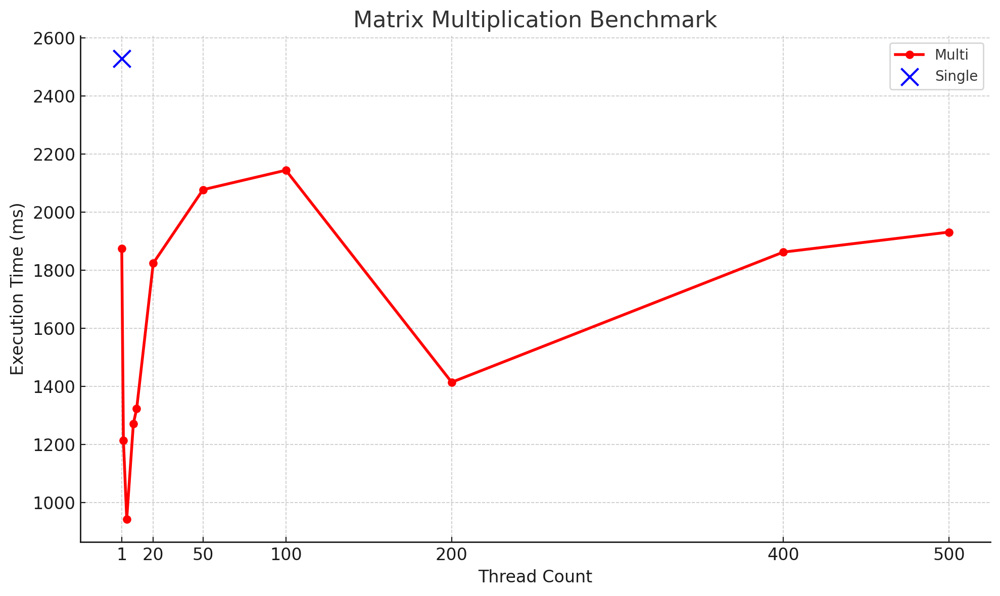

# COMP3432 Spring 2025 – Matrix Multiplier Project

## 📝 Summary
This project involves implementing **single-threaded** and **multi-threaded** matrix multiplication in Java. The goal is to efficiently multiply large square matrices using concurrency concepts while optimizing memory usage.

---

## ✅ Deliverables

- `MatrixMultiplier_SingleThread.java`
- `MatrixMultiplier_MultiThread.java`
- `matrix_input.txt`
- `matrix_benchmark_results.csv`
- Report (PDF) based on provided template

All files are submitted in a single `.zip` or `.rar` archive.

---

## 🔢 Technical Overview

- Matrix A is read row-by-row from the file during processing.
- Matrix B is fully loaded into memory and shared among threads.
- Uses only `Thread` or `Runnable` (no `ExecutorService`, `Future`, etc.)
- Compatible with provided benchmark scripts (`.bat` and `.sh`)

---

## 📆 Execution

### For Linux / macOS:
```bash
chmod +x run_matrix_benchmark.sh
./run_matrix_benchmark.sh
```

### For Windows:
```bat
run_matrix_benchmark.bat
```

The script will:
- Compile both Java versions
- Execute them with various thread counts
- Log results to `matrix_benchmark_results.csv`

---

## 📅 Benchmark Results

| Threads | Time (ms) | Mode           |
|---------|-----------|----------------|
| 1       | 2529      | SingleThreaded |
| 1       | 1875      | MultiThreaded  |
| 2       | 1215      | MultiThreaded  |
| 4       | 944       | MultiThreaded  |
| 8       | 1272      | MultiThreaded  |
| 10      | 1324      | MultiThreaded  |
| 20      | 1825      | MultiThreaded  |
| 50      | 2078      | MultiThreaded  |
| 100     | 2145      | MultiThreaded  |
| 200     | 1415      | MultiThreaded  |
| 400     | 1863      | MultiThreaded  |
| 500     | 1932      | MultiThreaded  |



---

## 📈 Observations

- The best performance (sweet spot) was achieved with **4 threads**.
- Performance degraded with too many threads due to context-switching and CPU core limitations.
- `System.currentTimeMillis()` was used for benchmarking; while coarse, it was sufficient for large-scale operations.
- Matrix A is streamed from disk to reduce memory usage, while Matrix B is preloaded for performance.

---

## 🔐 Constraints

- No use of advanced concurrency utilities like `ExecutorService`, `ForkJoin`, etc.
- Must follow provided method signatures and input/output format.
- Must be completed in pairs.

---

## 📚 Report Guidelines

The report should answer the following:

1. How did performance vary by thread count? What was the optimal count?
2. Why did performance degrade beyond the optimal number?
3. Why is Matrix A streamed while Matrix B is loaded in full?
4. How reliable is `System.currentTimeMillis()` for timing?

Use the provided template. Length: **300–500 words**
